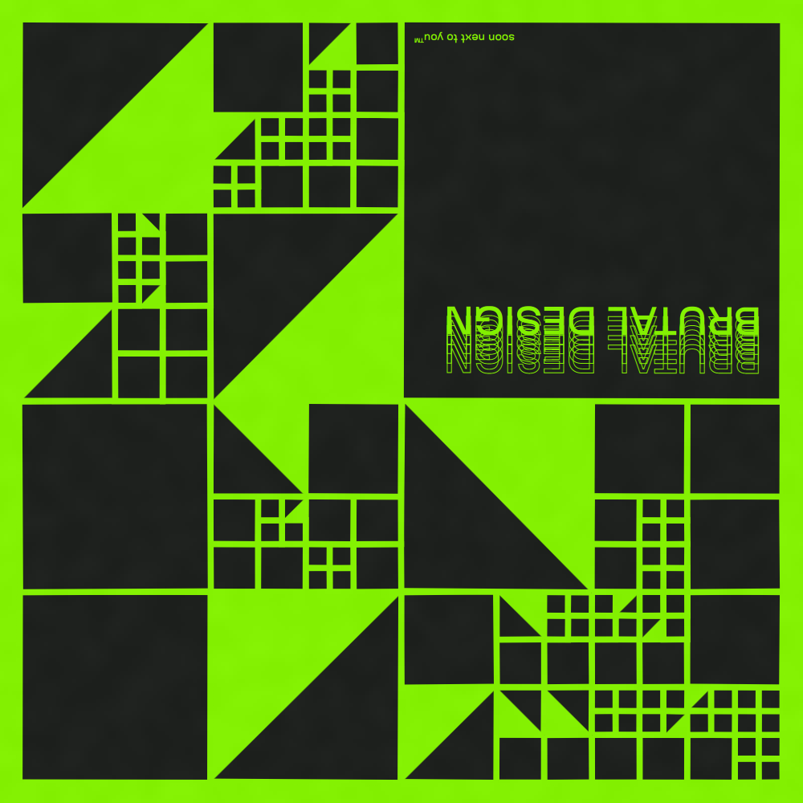
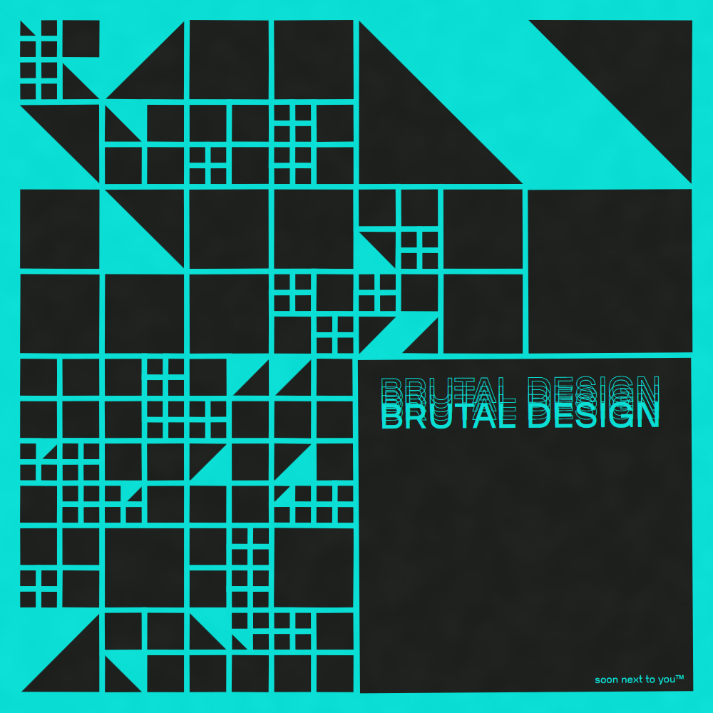
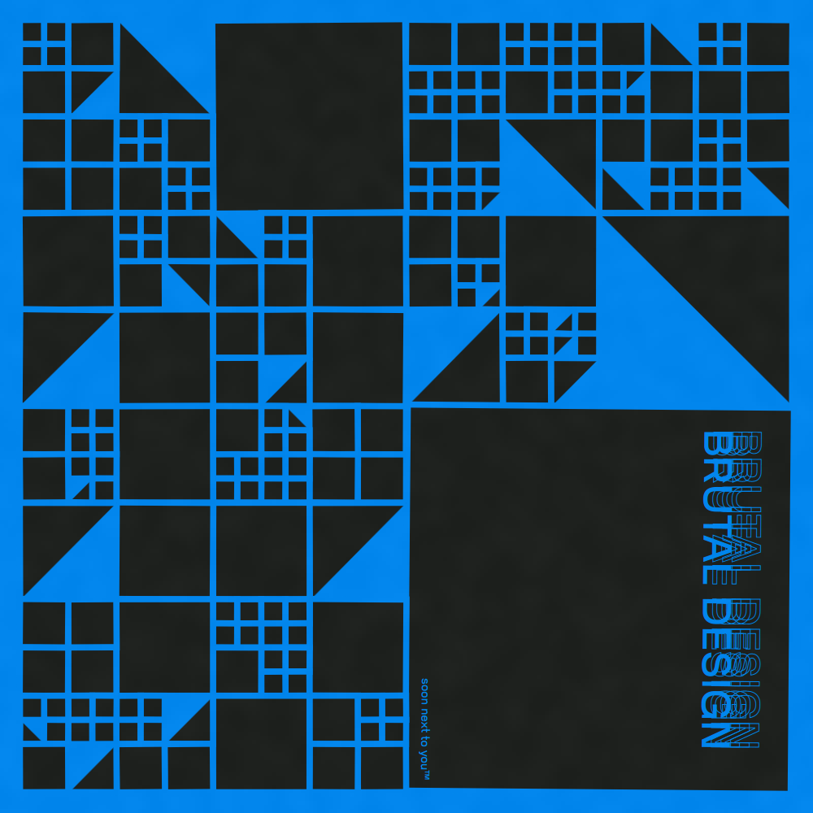
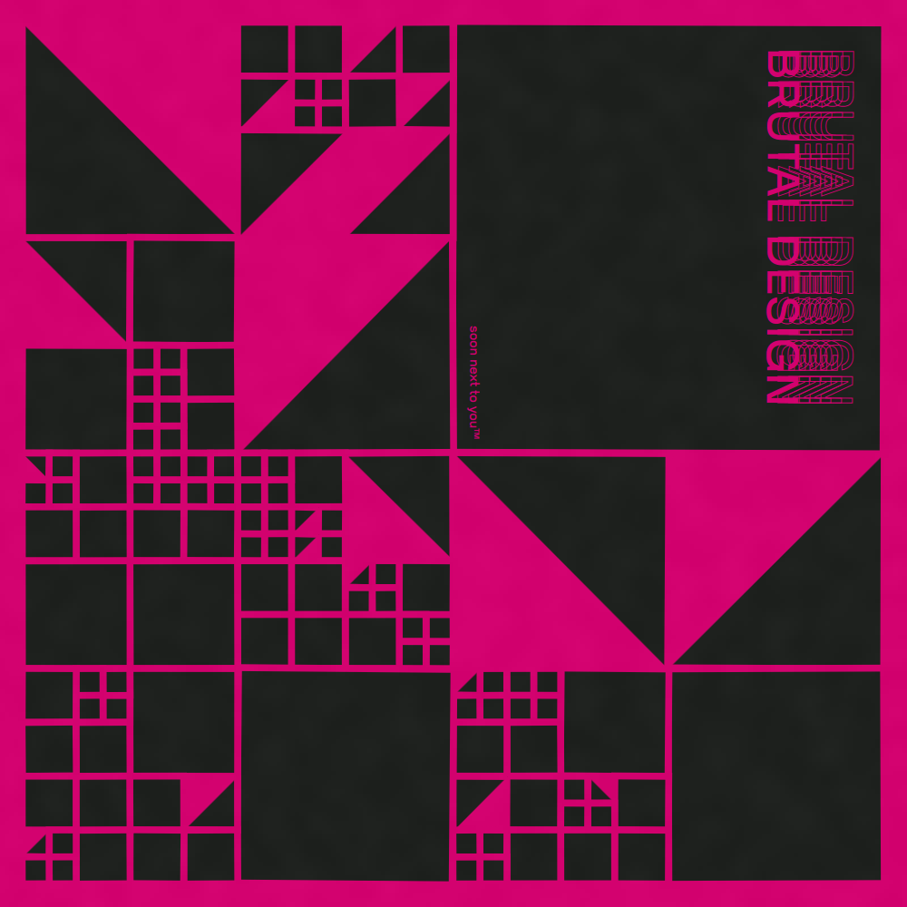

# Brutal Design

## Credits

This project is distributed under MIT license.
I don't claim any rights over the external libraries and assets packaged inside the project.

Font [Violet Sans by Violet Office](https://violetoffice.com/work/violet-sans) is packaged in this repository.

Font [Roboto](https://fonts.google.com/specimen/Roboto), made by Google, is packaged in this repository.

[JSzip](https://stuk.github.io/jszip/) library, made by [Stuart Knightley](https://github.com/Stuk), is packaged in this repository.

[simplex-noise.js](https://github.com/jwagner/simplex-noise.js) slightly, made by [Jonathan Wagner](https://github.com/jwagner), is packaged in this repository.
I have made some small changes to the original version.
